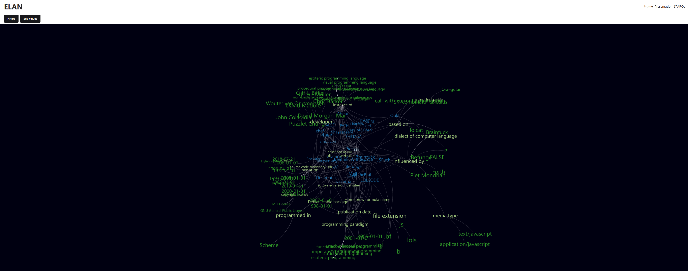

<div align="center">

  
  <h1>ELAN</h1>
  
  <p>
    Esoteric Language Explorer
  </p>
  
  
<!-- Badges -->   
<h4>
    <a href="https://github.com/Louis3797/awesome-readme-template/">View Demo</a>
  <span> · </span>
    <a href="https://github.com/Louis3797/awesome-readme-template">Documentation</a>

</div>

<br />

<!-- Table of Contents -->

# :notebook_with_decorative_cover: Table of Contents

- [About the Project](#star2-about-the-project)
  - [Screenshots](#camera-screenshots)
  - [Tech Stack](#space_invader-tech-stack)
  - [Features](#dart-features)
  <!-- - [Color Reference](#art-color-reference) -->
  - [Environment Variables](#key-environment-variables)
- [Getting Started](#toolbox-getting-started)
  - [Prerequisites](#bangbang-prerequisites)
  - [Installation](#gear-installation)
  - [Running Tests](#test_tube-running-tests)
  - [Run Locally](#running-run-locally)
  <!-- - [Deployment](#triangular_flag_on_post-deployment) -->
- [Usage](#eyes-usage)
  <!-- - [Roadmap](#compass-roadmap) -->
  <!-- - [Contributing](#wave-contributing) -->
    <!-- - [Code of Conduct](#scroll-code-of-conduct) -->
  <!-- - [FAQ](#grey_question-faq) -->
- [License](#warning-license)
- [Contact](#handshake-contact)
- [Acknowledgements](#gem-acknowledgements)

<!-- About the Project -->

## :star2: About the Project

<!-- Screenshots -->

### :camera: Screenshots

<div align="center"> 
  
  
</div>

<!-- TechStack -->

### :space_invader: Tech Stack

<details>
  <summary>Client</summary>
  <ul>
    <li><a href="https://www.typescriptlang.org/">Typescript</a></li>
    <li><a href="https://reactjs.org/">React.js</a></li>
    <li><a href="https://chakra-ui.com/">Chakra UI</a></li>
  </ul>
</details>

<details>
  <summary>Server</summary>
  <ul>
    <li><a href="https://dotnet.microsoft.com/en-us/">.Net Core 8</a></li>
  </ul>
</details>

<details>
<summary>Database</summary>
  <ul>
    <li><a href="https://query.wikidata.org/"> Wikidata Query Service</a></li>
  </ul>
</details>

<details>
<summary>DevOps</summary>
  <ul>
    <li><a href="https://www.docker.com/">Docker</a></li>
    <li><a href="https://learn.microsoft.com/en-us/azure/dns/dns-overview">Azure DNS Zone</a></li>
    <li><a href="https://azure.microsoft.com/en-us/products/container-registry">Azure Container Registry</a></li>
    <li><a href="https://azure.microsoft.com/en-us/products/kubernetes-service">Azure Kubernetes Service</a></li>
  </ul>
</details>

<!-- Features -->

### :dart: Features

- Visualization of esoteric programming languages in a graph network.
- Filtering and recommending of esoteric languages based on user's preferences.
- Esoteric language entity view for more ample information.
- SPARQL query console for an in-depth analysis of the languages.
<!-- Color Reference -->

<!-- ### :art: Color Reference

| Color           | Hex                                                              |
| --------------- | ---------------------------------------------------------------- |
| Primary Color   |  #222831 |
| Secondary Color |  #393E46 |
| Accent Color    |  #00ADB5 |
| Text Color      |  #EEEEEE | -->

<!-- Env Variables -->

### :key: Environment Variables

To run this project, there is no need for environment variables.

<!-- Getting Started -->

## :toolbox: Getting Started

<!-- Prerequisites -->

### :bangbang: Prerequisites

- Node.js.
- npm.
- Visual Studio.

<!-- Installation -->

<!-- Running Tests -->

### :test_tube: Running Tests

To run tests, run the following command

```bash
  yarn test test
```

<!-- Run Locally -->

### :running: Run Locally

Clone the project

```bash
  git clone https://github.com/elanguages/ELAN.git
```

Go to the project directory

```bash
  cd ELAN/FrontEnd
```

Install dependencies

```bash
  npm install
```

Start the server with Visual Studio and start the client

```bash
  npm run dev
```

<!-- Usage -->

## :eyes: Usage

Use this space to tell a little more about your project and how it can be used. Show additional screenshots, code samples, demos or link to other resources.

```javascript
import Component from "my-project";

function App() {
  return <Component />;
}
```

<!-- License -->

## :warning: License

MIT. See LICENSE for more information.

<!-- Contact -->

## :handshake: Contact

Marcu Eduard - marcu.eduard37@gmail.com
Dragoi George Stefan - dragoigeorgestefan@gmail.com

<!-- Acknowledgments -->

## :gem: Acknowledgements

- [Readme Template](https://github.com/Louis3797/awesome-readme-template/)
